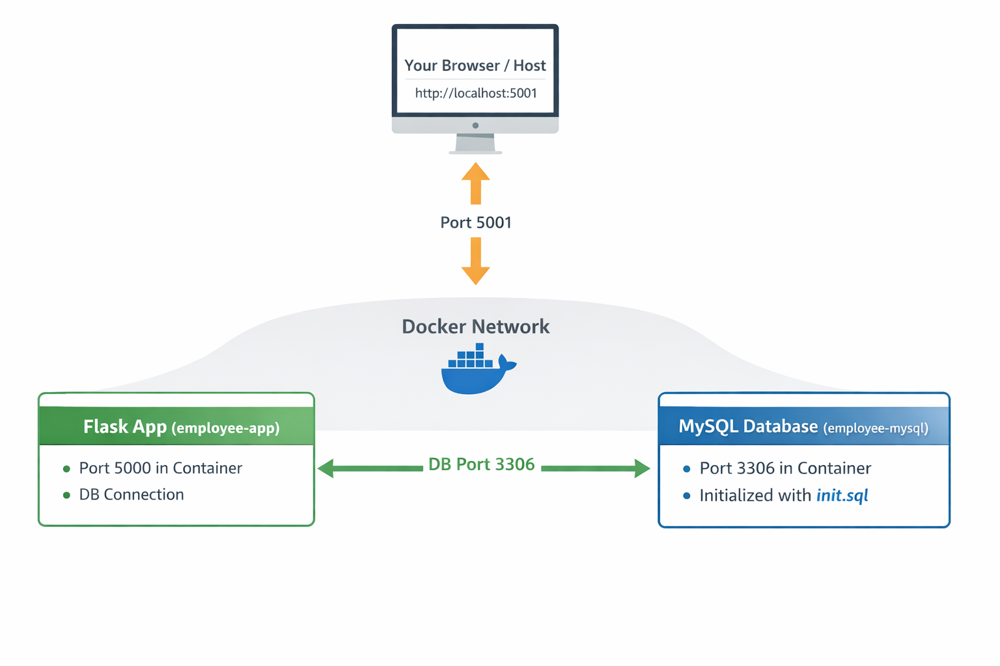
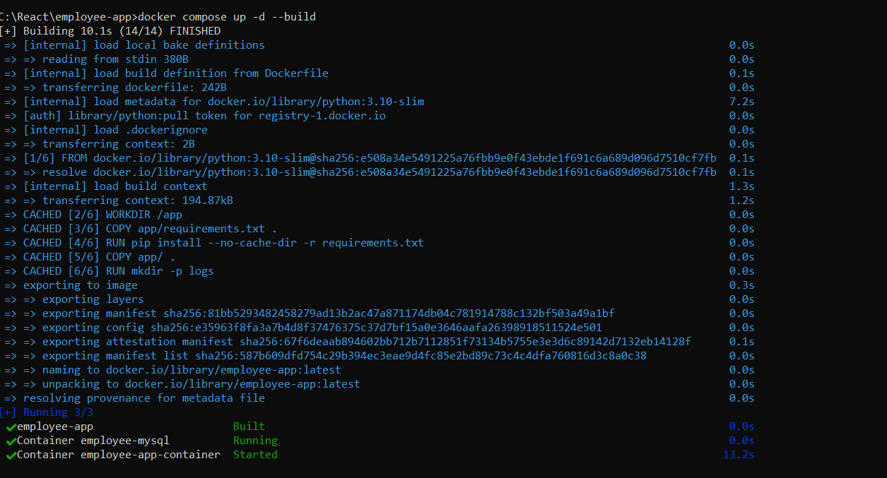
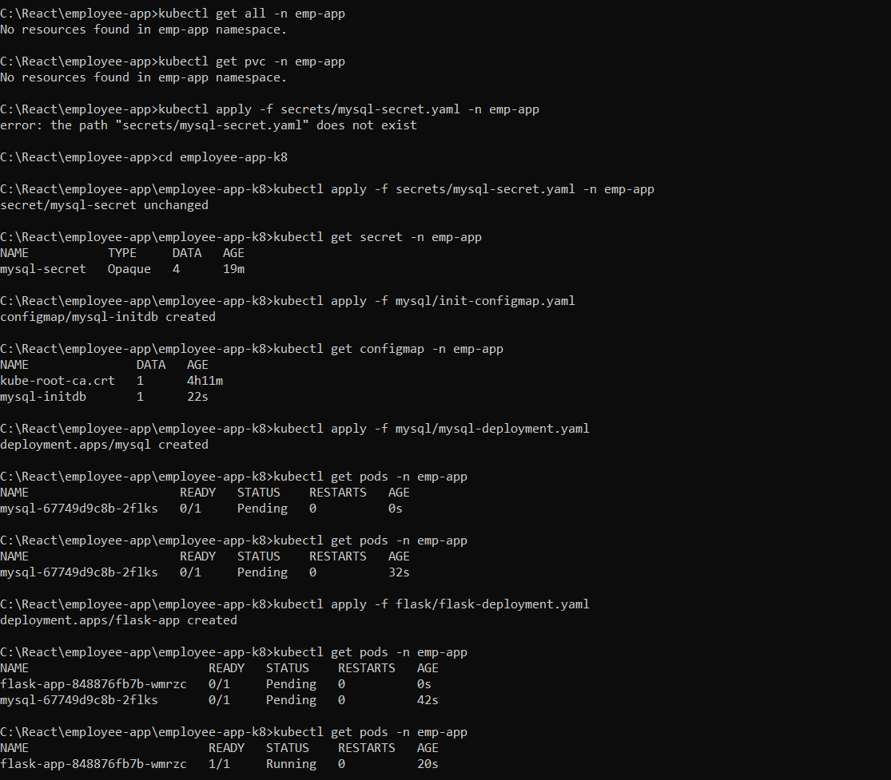
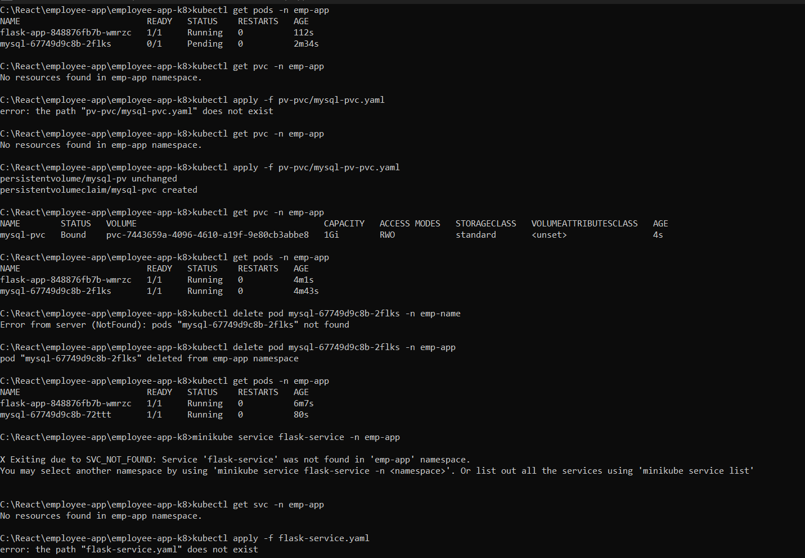
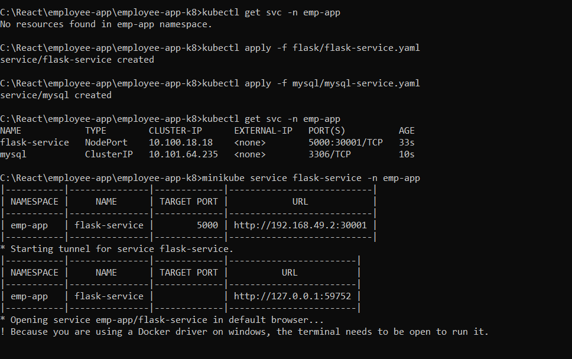
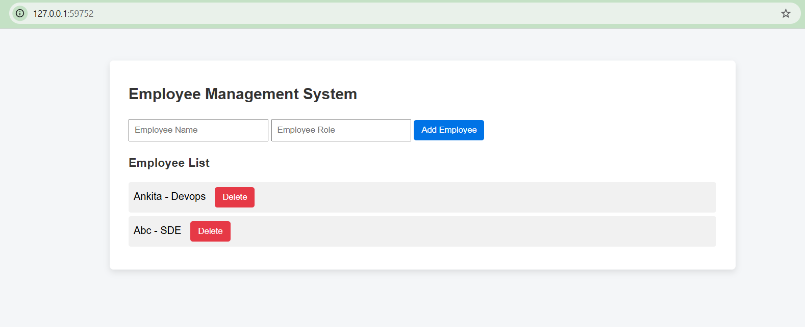

## 👩‍💻 Author

**Ankita Ubale**  
GitHub: https://github.com/ankitaubale1323  

This project was designed and developed by me as a Dockerized Flask + MySQL application.

# Employee App

This project is a **Python Flask application** for managing employees, using **MySQL** as the database. The app is fully containerized with **Docker** and **Docker Compose**, so you can run it anywhere without installing Python or MySQL locally.

---

## **Project Structure**..

```
employee-app/
│
├─ app/
│   ├─ __init__.py
│   ├─ app.py               # Main Flask application
│   ├─ requirements.txt    # Python dependencies
│   └─ ...
│
├─ app/mysql-init/
│   └─ init.sql             # MySQL initialization script
│
├─ app/docker/
│   └─ Dockerfile           # Dockerfile for Flask app
│
|--employee-app-k8/
├── flask/
│   ├── flask-deployment.yaml
│   └── flask-service.yaml       # NEW: Service for Flask app
├── mysql/
│   ├── mysql-deployment.yaml
│   ├── mysql-initdb-configmap.yaml
│   └── mysql-service.yaml       # NEW: Service for MySQL
├── pv-pvc/
│   └── mysql-pvc.yaml
├── secrets/
│   └── mysql-secret.yaml
├── namespaces/
│   └── emp-app-namespace.yaml
├── README.md

├─ docker-compose.yml       # Docker Compose file for multi-container setup
└─ README.md
```

-----------------------------------------------------------------------------------

## **File Details**

### **1️ Dockerfile (`app/docker/Dockerfile`)**

* Base image: Python 3.10 slim
* Sets working directory `/app`
* Installs dependencies from `requirements.txt`
* Copies Flask app code into the container
* Creates `logs/` folder
* Runs the Flask app

------------------------------------------------------------------------------------------------

### **2️ docker-compose.yml**

* **employee-app** → Flask container
* **mysql** → MySQL container
* Maps ports: `5001:5000` (Flask), `3307:3306` (MySQL)
* Sets environment variables for DB connection
* Mounts `mysql-init` folder to auto-create database and tables

--------------------------------------------------------------------------------------

### **3️ mysql-init/init.sql**

Initializes the database:

```sql
CREATE DATABASE IF NOT EXISTS employee_db;

USE employee_db;

CREATE TABLE IF NOT EXISTS employees (
    id INT AUTO_INCREMENT PRIMARY KEY,
    name VARCHAR(100) NOT NULL,
    role VARCHAR(100) NOT NULL,
    created_at TIMESTAMP DEFAULT CURRENT_TIMESTAMP
);
```

--------------------------------------------------------------------------------------

## **Step-by-Step Setup Guide**

### **Step 1: Install Git**

* Download Git: [https://git-scm.com/downloads](https://git-scm.com/downloads)
* Install with default settings
* Verify installation:

```bash
git --version
```

--------------------------------------------------------------------------------------

### **Step 2: Fork the Repository**


```bash
git clone https://github.com/ankitaubale1323/employee-aap.git
cd employee-aap
```

#### Fork (Optional)**

1. Go to the repo on GitHub → Click **Fork**
2. Clone your fork:

```bash
git clone https://github.com/<your-username>/employee-aap.git
cd employee-aap
```

--------------------------------------------------------------------------------------

### **Step 3: Install Docker Desktop**

1. Download Docker Desktop: [https://www.docker.com/products/docker-desktop](https://www.docker.com/products/docker-desktop)
2. Install and check **“Install required WSL 2 components”**
3. Finish installation and **restart computer** if needed
4. Open Docker Desktop → Wait until it says **“Docker is running”**

--------------------------------------------------------------------------------------

### **Step 4: Verify Docker**

Open PowerShell and run:

```bash
docker --version
docker compose version
```

* Should show installed Docker and Compose versions

Test with:

```bash
docker run hello-world
```

--------------------------------------------------------------------------------------

### **Step 5: Run the Project with Docker Compose**

1. Build and start containers:

```bash
docker-compose up -d --build
```

2. Check running containers:

```bash
docker ps
```

You should see:

* `employee-app-container` → Flask app (port 5001)
* `employee-mysql` → MySQL (port 3307)

--------------------------------------------------------------------------------------

### **Step 6: Verify Database**

1. Connect to MySQL:

```bash
docker exec -it employee-mysql mysql -u employee_user -p
# password: root
```

2. Check tables:

```sql
USE employee_db;
SHOW TABLES;
```

You should see the `employees` table.

--------------------------------------------------------------------------------------

### **Step 7: Access the App**

Open in browser:

```
http://localhost:5001/employees
```

--------------------------------------------------------------------------------------

### **Step 8: Stop and Remove Containers**

To stop containers and remove volumes:

```bash
docker-compose down -v
```

--------------------------------------------------------------------------------------

### **Notes**

* Ensure **DB_PASSWORD in Flask** matches **MYSQL_PASSWORD in MySQL**
* Init SQL only runs on **first container start**
* Modify `app/mysql-init/init.sql` for additional tables or seed data

--------------------------------------------------------------------------------------


+---------------------+             +--------------------+
|  Flask App          |             |   MySQL Database   |
|  (employee-app)     | <---------> |  (employee-mysql) |
|                     |   TCP 3306  |                    |
| - Runs in Docker    |             | - Runs in Docker   |
| - Port 5000 inside  |             | - Port 3306 inside|
|   container         |             | - Initialized via |
| - Exposed 5001 on   |             |   init.sql        |
|   host              |             |                    |
+---------------------+             +--------------------+
           ^
           | Port 5001
           v
     Your Browser / Host


## Explanation

# 1.Flask app container (employee-app)

- Runs Flask on port 5000 internally

- Exposed to host port 5001 so you can access via browser: http://localhost:5001

- Connects to MySQL using DB_HOST = mysql (the service name in Docker Compose)

# 2.MySQL container (employee-mysql)

- Runs MySQL on port 3306 inside the container

- Host port 3307 maps to container port 3306 (optional, for direct DB access)

- Uses init.sql to create employee_db and employees table

# 3.Docker network

- Docker Compose creates a network so containers can communicate by service name (mysql)

# 4. Browser / Host

- You access the Flask app via http://localhost:5001

- Flask app internally connects to MySQL using the service



### Employee Management App - Kubernetes Deployment Guide



## **Step 0 — Prerequisites**

* Install **Minikube**, **kubectl**, **Docker**.
* Start Minikube:

```bash
minikube start
cd employee-qapp-k8
```

* Create namespace for the app:

```bash
kubectl apply -f namespaces/emp-app-namespace.yaml
kubectl get ns
```

---

## **Step 1 — Clean up previous deployments**

If anything is running from old deployments:

```bash
kubectl delete deployment flask-app mysql -n emp-app
kubectl delete service flask-service mysql -n emp-app
kubectl delete secret mysql-secret -n emp-app
kubectl delete configmap mysql-initdb -n emp-app
kubectl delete pvc mysql-pvc -n emp-app
```

Check everything is deleted:

```bash
kubectl get all -n emp-app
kubectl get pvc -n emp-app
```

---

## **Step 2 — Apply Secrets**

* File: `secrets/mysql-secret.yaml`

Apply:

```bash
kubectl apply -f secrets/mysql-secret.yaml -n emp-app
kubectl get secret -n emp-app
```

**Common Error:**

* `unchanged` → means secret already exists, no problem.

---

## **Step 3 — Apply ConfigMap (MySQL init)**

* File: `mysql/init-configmap.yaml`

Apply:

```bash
kubectl apply -f mysql/init-configmap.yaml -n emp-app
kubectl get configmap -n emp-app
```

---

## **Step 4 — Apply PVC**

* File: `pv-pvc/mysql-pv-pvc.yaml`

Apply:

```bash
kubectl apply -f pv-pvc/mysql-pvc.yaml -n emp-app
kubectl get pvc -n emp-app
```

**Common Error:**

* If PVC shows `Pending` → no PV available → fix storage class or delete & reapply PVC.

---

## **Step 5 — Apply MySQL Deployment**


* File: `mysql/mysql-deployment.yaml`
Apply:

```bash
kubectl apply -f mysql/mysql-deployment.yaml -n emp-app
kubectl get pods -n emp-app -w
```

**Common Error:**

* Pod stuck in `Pending` → usually PVC missing (Step 4).

Check logs:

```bash
kubectl logs <mysql-pod> -n emp-app
```

---

## **Step 6 — Apply Flask Deployment**

* File: `flask/flask-deployment.yaml`


Apply:

```bash
kubectl apply -f flask/flask-deployment.yaml -n emp-app
kubectl get pods -n emp-app
kubectl logs -f <flask-pod-name> -n emp-app
```

**Common Error:**

* `Waiting for MySQL... 1045 (28000)` → Secret mismatch
* `500 Internal Server Error` → Flask cannot connect to DB

---

## **Step 7 — Expose Flask Service**

```bash
kubectl expose deployment flask-app \
  --type=NodePort \
  --name=flask-service \
  --port=5000 \
  -n emp-app
kubectl get svc -n emp-app
```

Access Flask app:

```bash
minikube service flask-service -n emp-app
```

---

## **Step 8 — Test Flask App**

### **POST /employees**

```bash
curl -X POST http://<minikube-ip>:<nodeport>/employees \
-H "Content-Type: application/json" \
-d '{"name": "Ankita", "role": "Developer"}'
```

### **GET /employees**

```bash
curl http://<minikube-ip>:<nodeport>/employees
```

✅ You should see the employee data.

---

## **Common Errors & Fixes**

| Error              | Cause                         | Fix                                        |
| ------------------ | ----------------------------- | ------------------------------------------ |
| Pod Pending        | PVC missing                   | Create PVC (Step 4)                        |
| 1045 Access denied | Secret values mismatch        | Update `mysql-secret.yaml` and reapply     |
| Flask 500 error    | Flask cannot connect to MySQL | Check env vars, MySQL pod logs             |
| Service not found  | Service not created           | Use `kubectl expose` or apply service YAML |

---

This documentation covers **everything** from scratch:

* Create namespace → secrets → configmap → PVC → MySQL → Flask → Service → test endpoints.

---






