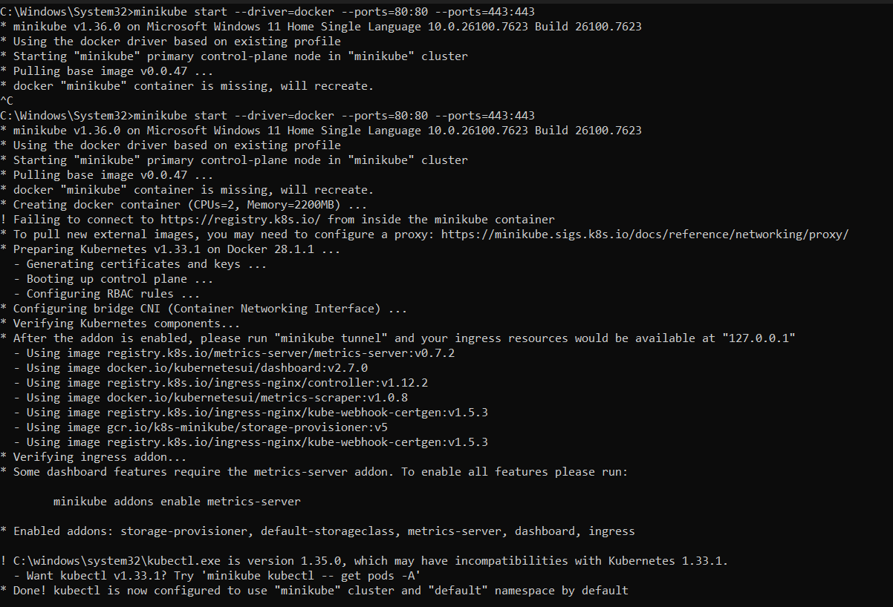
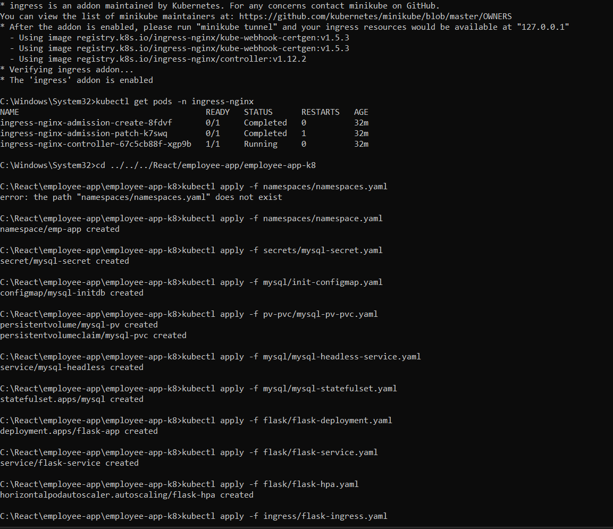

````markdown
# Employee Management App - Kubernetes Deployment

This project is a **Flask-based Employee Management application** with a **MySQL database**, deployed on **Kubernetes**.  
It demonstrates the use of **StatefulSets, Deployments, Services, Ingress, and HPA (Horizontal Pod Autoscaler)**.

---

## **Project Architecture**

- **Flask App**: REST API + web frontend to manage employees.
- **MySQL**: Backend database, deployed as a **StatefulSet** to maintain persistent data.
- **Ingress**: Routes HTTP traffic from outside the cluster to Flask service.
- **HPA (Horizontal Pod Autoscaler)**: Automatically scales Flask pods based on CPU usage.
- **Services**: Allow pods to communicate with each other.

---

## **Key Kubernetes Concepts**

### 1. **StatefulSet**
- **Purpose:** Used for databases or apps that need **stable identity and persistent storage**.
- **Example:** MySQL StatefulSet.
- **Why we use it:**  
  - Pods get a **stable network identity** (like `mysql-0`).  
  - Persistent storage ensures **data is not lost** on pod restart.  
- **Difference from Deployment:** Deployments are stateless; StatefulSets maintain identity and storage.

---

### 2. **Ingress**
- **Purpose:** Route external HTTP traffic to internal Kubernetes services.
- **How it works:** Acts like a **reverse proxy**.  
  - Example: Requests to `flask.local` → routed to `flask-service` → Flask pods.
- **Why we use it:**  
  - Avoid exposing multiple NodePorts.  
  - Supports **host-based and path-based routing**.
- **Controller:** We use **NGINX Ingress Controller** to handle traffic.

---

### 3. **HPA (Horizontal Pod Autoscaler)**
- **Purpose:** Automatically adjusts the number of pods based on resource usage.
- **Example:** Scale Flask app pods between 1–5 based on CPU.
- **Why we use it:**  
  - Handles **high traffic spikes** automatically.  
  - Maintains **application performance**.
- **Command to check HPA:**
```bash
kubectl get hpa -n emp-app
````

---

### 4. **Services**

* **Purpose:** Expose pods internally or externally.
* **Types:**

  * **ClusterIP (default):** Internal communication only.

    * Used for `flask-service` and `mysql-headless`.
  * **NodePort:** Exposes service on host port, sometimes used by ingress controller.
* **Why we use it:**

  * Pods have dynamic IPs → Service gives stable **DNS name** inside cluster.

---

### 5. **Ingress Controller**

* **Purpose:** Listens for Ingress resources and routes HTTP traffic.
* **Example:** `ingress-nginx-controller` in `ingress-nginx` namespace.
* **Why we use it:**

  * Required to make Ingress resources functional.
* **Port mapping:** On Windows Docker driver, map host ports 80/443 → container ports 80/443.

---

### 6. **Hosts File Setup (Windows)**

**Purpose:** Map `flask.local` domain to localhost IP so browser can access Ingress.

1. Open **Notepad as Administrator**:

   * Press **Windows Key → type Notepad → Right Click → Run as Administrator**
2. Open file:

```
C:\Windows\System32\drivers\etc\hosts
```

3. Add this line at the end:

```
127.0.0.1    flask.local
```

4. Save file.

5. Flush DNS so changes take effect:

```bash
ipconfig /flushdns
```

6. Now you can access in browser:

```
http://flask.local
```

**Why we do this:**

* `flask.local` is a **fake domain**.
* Hosts file tells Windows: "When user types `flask.local`, go to 127.0.0.1"
* Ensures browser traffic reaches Minikube Ingress.

---

## **How to Run (Windows + Docker Driver)**

```bash
# create docker images
docker compose up -d --build

check the image and container is created 
check images is pused to docker hub if then push image to docker hub.. 


# Start Minikube with port mapping
minikube start --driver=docker --ports=80:80 --ports=443:443

# Enable ingress addon
minikube addons enable ingress

# Apply Kubernetes resources


flow all command in image for apply...
its has correct file path


# Flush DNS (after updating hosts file)
ipconfig /flushdns
```

---

## **Optional Debugging**

* Check pods:

```bash
kubectl get pods -n emp-app
```

* Check services:

```bash
kubectl get svc -n emp-app
kubectl get svc -n ingress-nginx
```

* Check Ingress:

```bash
kubectl get ingress -n emp-app
kubectl describe ingress flask-ingress -n emp-app
```

* Check Flask logs:

```bash
kubectl logs -n emp-app <flask-pod-name>
```

* Port-forward as last resort:

```bash
kubectl port-forward svc/flask-service 5000:5000 -n emp-app
```

Then open: `http://localhost:5000`

---

## **Diagram (Traffic Flow)**

```
Browser (flask.local) → Hosts file → localhost:80
   ↓
Ingress-nginx Controller → Flask Service → Flask Pods
   ↓
Optional: HPA monitors CPU → scales Flask pods
   ↓
MySQL StatefulSet → persistent storage
```

---

## ✅ Key Learnings

* How **Ingress works** for HTTP routing
* How **StatefulSet maintains persistent DB**
* How **HPA auto-scales pods**
* Windows + Docker driver networking issues and host file mapping
* Full Kubernetes app deployment lifecycle

---

```
